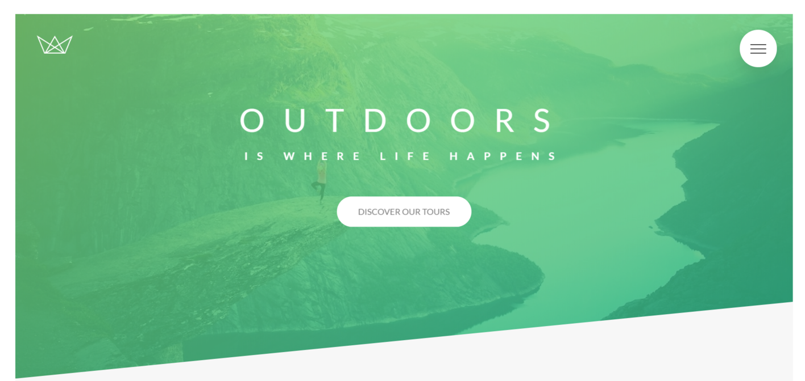
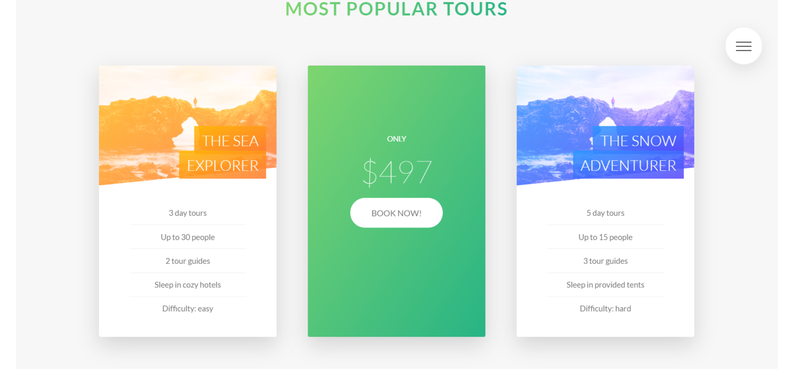
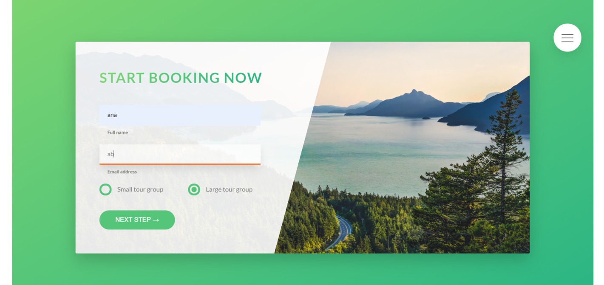

# Frontend-Project
### This is one of my projects made following an advanced css and sass course. Here are some photos of the website:




### The project contains 9 main sections: 
* header
* the about section
* features section
* tours section
* stories section
* book section
* footer
* menu
* popup

### Main notions that I've learned after this course:
* best way to perform basic reset with universal selector(*)
* set project-wide font definitions
* clip parts of elements using clip-path
* center anything with the transform, top and left properties
* Creating CSS Animations using @keyframes and animation property
* what classes, pseudo-elements and pseudo-classes are
* use the ::after pseudoelement
* create hover animation effect using transition property
* how to use the background-clip property, how to transform multiple properties simultaneously, how to use outline-offset property together with outline, how to style elements that are NOT hovered while others are.
* use the direct child
* build a rotating card, use perspective in CSS, use backface-visibility property, use background blend modes, how and when to use box- decoration-break
* how to make text flow around shapes with shape-outside and float, How to apply a filter to images,How to create a backround video covering an entire section, how to use the HTML element, how and when to use the object-fit property
* how to implement solid-color-gradients, how the general and adjacent sibling selectors work and why we need them, how to use the * ::input-placeholder pseudo element, how and when to use the : focus, :invalid, pseudoholder-shown and :checked pseudoclasses, techniques * to build custom radio buttons
* what the checkbox hack is and how it works, how to create custom aimation timing functions using cubic bezier curves, how to animate solid-color gradients, how and why to use transform-origin, in general create an amazing creative effect
how to build a nice popup with only CSS, how to use the :target pseudo-class, how to create boxes with equal height using display: table-cell; how to create CSS text columns, how to automatically hyphenate words using hyphens
* Sass Mixins to Write Media Queries
* The Three Pillars of writing good CSS and HTML: 
		:one: Responsive Design: Fluid Layouts,Media Queries, Responsive Images, Corrent Units, Desktop-first or Mobile-First 
    :two: Maintainable/Scalable Code: Clean,Easy to understand, Growth, Reusable, How to organize files, How to name classes, how to structure HTML 
    :three: Web Performance: Less HTTP requests, less code, compress code, use css preprocessor,less images, compress images
* how CSS works behind the scenes
    ```Browser Render Flow: Load HTML -> Parse HTML-> DOM ->Load CSS-> Parse CSS (Resolve conficts, process final values) -> CSSOM ->-> Render Tree -> visual formating model -> Final Render```
* how CSS is Parsed: The cascade and Specificity, Value Processing, Inheritance
* how and why use rem units in our project, a good workflow to convert px to rem
* how CSS Renders a Website: The Visual Formatting Model
* CSS Architecture Components and BEM (implementing)
* SASS: Arhitecture, Symtax, etc (Variables, Nesting Mixins, Extends and Functions)
* NPM: packages(installing), scripts(write and compiles sass locally)
* Basic Principles of Responsive Design and Layout Types
* Building a Custom Grid with Floats
* Mobile-First vs Desktop First and Breakpoints
* Responsive Images in HTML - Art Direction, Density and Resolution Switching
* Responsive Images in CSS
* Testing for browser support with @supports

